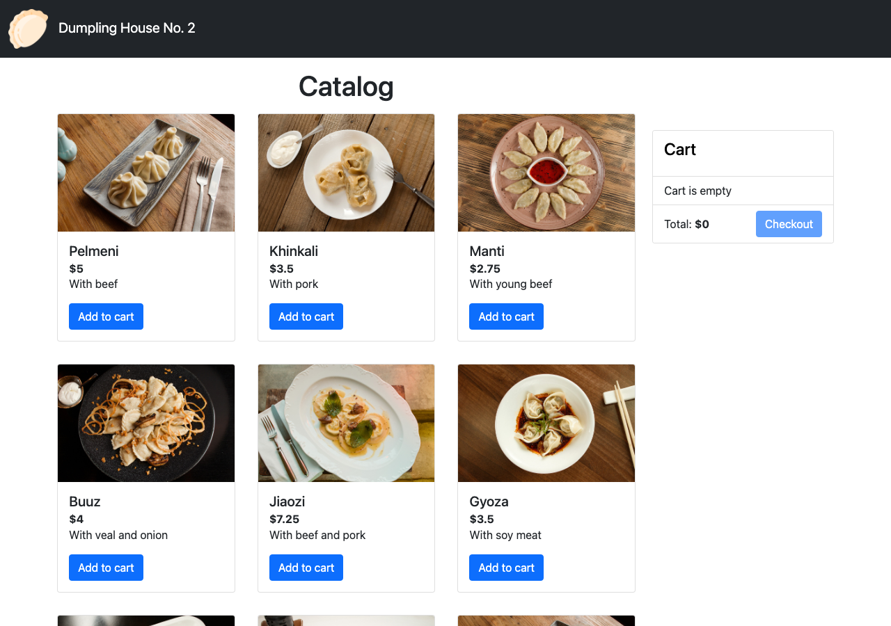
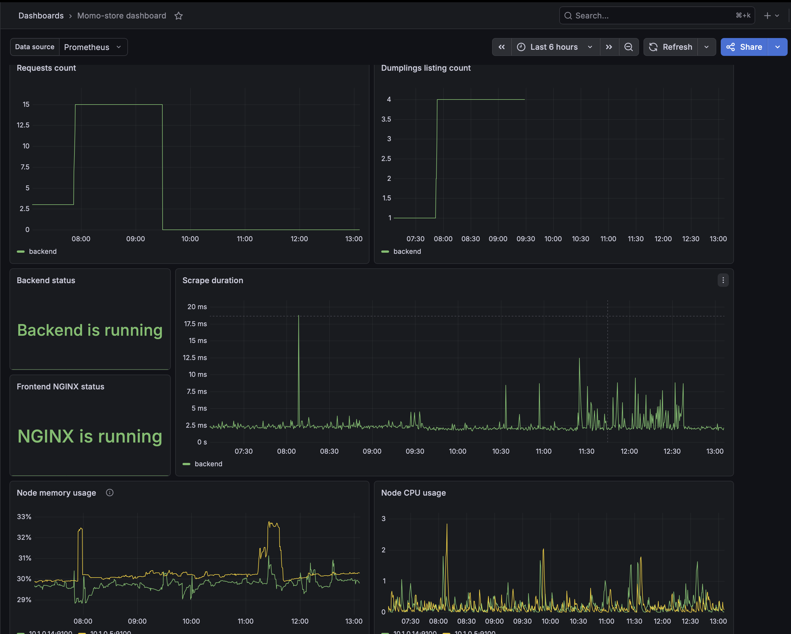

# Momo Store aka Dumpling House No. 2





---

A demo dumpling store (Vue 3 + TypeScript frontend, Go backend) shipped end-to-end on **Yandex Cloud Managed Kubernetes** through a GitLab CI/CD pipeline: built with kaniko, scanned with Trivy/SonarQube, published to Nexus + Yandex Container Registry, deployed with Helm, exposed over HTTPS via the Gateway API (GWIN + Application Load Balancer + managed Let's Encrypt certificate), and observed with kube-prometheus-stack (Prometheus + Grafana + Alertmanager → Telegram).

## Table of Contents

- [Local Development](#local-development)
- [Git Branching Strategy](#git-branching-strategy)
- [Versioning & Release Triggering](#versioning--release-triggering)
- [Pipeline Architecture](#pipeline-architecture)
- [Security](#security)
- [Deployment Strategy](#deployment-strategy)
- [GitLab CI/CD Variables](#gitlab-cicd-variables)
- [Preconditions](#preconditions)
- [Provisioning the Infrastructure & Application](#provisioning-the-infrastructure--application)
- [Teardown](#teardown)
- [TODO / Roadmap](#todo--roadmap)

---

## Local Development

### Frontend

```bash
cd frontend
npm install
NODE_ENV=production VUE_APP_API_URL=http://localhost:8081 npm run serve
```

### Backend

```bash
cd backend
go run ./cmd/api          # listens on :8081
go test -v ./...
```

---

## Git Branching Strategy

The project follows a **trunk-based, GitLab-Flow** model:

- **`master`** is the single long-lived, protected, default branch. It is always deployable — every commit on `master` runs the full pipeline.
- **Feature / fix branches** (`feature/*`, `fix/*`, …) branch off `master` and are merged back through **Merge Requests**.
- On a **Merge Request**, the pipeline runs the quality gates only (SonarQube scan + quality gate). No infrastructure is touched and nothing is released.
- A merge to `master` runs the full pipeline; whether it **releases** new artifacts and images depends on the commit message (see versioning below).
- Releases are immutable: a `vX.Y.Z` git tag and a GitLab Release are created automatically by the pipeline.

```
feature/* ──MR──▶ master ──(release: commit)──▶ build + tag vX.Y.Z ──▶ deploy
   │                 │
   └─ Sonar gate     └─ full pipeline
```

---

## Versioning & Release Triggering

Versioning is **Semantic Versioning** (`vMAJOR.MINOR.PATCH`, e.g. `v3.1.2`).

A new release is **triggered by the commit message**, not by a manual tag. The `extract_tag` job greps the commit title for the pattern:

```
release:v<MAJOR>.<MINOR>.<PATCH>
```

Example:

```bash
git commit -m "Add: release:v3.2.0 New cart endpoint"
```

- If the tag pattern **is** present → the `build` stage runs (artifacts → Nexus, images → YCR), a GitLab Release `vX.Y.Z` is created, and the `deploy` stage rolls the new version out.
- If the tag pattern is **absent** → the app is **not** rebuilt. The `deploy` stage re-deploys the **latest existing release** (`extract_new_tag` reads it from the GitLab Releases API). This is intentional: infrastructure/Helm changes can be applied without forcing a new application build.

The extracted tag is propagated to downstream jobs through a `dotenv` artifact (`release.env`) and stamped into each Helm chart's `appVersion` at deploy time, so `helm list` reflects exactly what is running.

---

## Pipeline Architecture

The pipeline is split into one file per stage under [`_cicd-pipe/`](_cicd-pipe/), assembled by the root [`.gitlab-ci.yml`](.gitlab-ci.yml). Reusable logic lives in hidden templates in `1_main.yaml` (`.yc_install`, `.go-cache`, `.ssh_vm_docker`).

| # | Stage | File | Key jobs | Notes |
|---|-------|------|----------|-------|
| 1 | `extract` | `2_tagging.yaml` | `extract_tag` | Parses `release:vX.Y.Z` from the commit, exports `RELEASE_TAG` via dotenv. |
| 2 | `provision` | `3_provision.yaml` | `provision:s3_bucket`, `provision:container_registry`, `provision:vm_docker`*, `provision:k8s`, `provision:DaemonSet` | Terraform on YC: S3 (TF state), Container Registry, K8s cluster + VPC, node-drainer DaemonSet. Bucket/registry are **manual** one-time jobs. |
| 3 | `test` | `4_test.yaml` | `test:backend`, `lint:iac` | `go test` with JUnit + Cobertura coverage; `tflint` + `helm lint`. |
| 4 | `analyze` | `5_analyse.yaml` | `sonarqube:scan`, `sonarqube:gate` | SonarQube scan + quality-gate check (`allow_failure`, the provided edu instance is flaky). |
| 5 | `monitoring` | `6_monitoring.yaml` | `monitoring:prometheus` | Installs Prometheus Operator CRDs + kube-prometheus-stack, Telegram secret, Grafana dashboard ConfigMap. |
| 6 | `build` | `7_build.yaml` | `build-release:{backend,frontend}`, `build:{backend,frontend}_kaniko`, `trivy:{backend,frontend}`, `create_release` | Builds artifacts → Nexus, container images with **kaniko** → YCR, **Trivy** image scan, then the GitLab Release. Runs only on release commits. |
| 7 | `deploy` | `8_deploy.yaml` | `extract_new_tag`, `deploy:backend`, `deploy:frontend`, `deploy:gwin`, `rollback:*` | Helm deploys to the cluster, then provisions the ALB + HTTPS Gateway. |
| 8 | `destroy` | `9_destroy.yaml` | `destroy:helm`, `destroy:gwin`, `destroy:k8s`, `destroy:s3_bucket`, `destroy:container_registry`, `destroy:vm_docker` | All **manual** teardown jobs, ordered to respect cloud dependencies. |

\* `vm_docker` is the **legacy** Docker-build-on-a-VM path (now superseded by kaniko, jobs prefixed `.`/disabled). Kept for reference; see TODO.

**Build flow (release commit):**

```
extract_tag
   ├─▶ test:backend / lint:iac
   ├─▶ sonarqube:scan ─▶ sonarqube:gate
   ├─▶ monitoring:prometheus ──────────────┐
   ├─▶ build-release:backend ─▶ build:backend_kaniko ─▶ trivy:backend ─┐
   └─▶ build-release:frontend ─▶ build:frontend_kaniko ─▶ trivy:frontend ┤
                                                                         └─▶ create_release
                                                                                  └─▶ deploy:backend ─▶ deploy:frontend ─▶ deploy:gwin
```

Container images are built with **kaniko** (no Docker daemon, no privileged runner), pushed to `cr.yandex/<registry-id>/{backend,frontend}:<tag>` and `:latest`. Source tarballs and compiled Go/Vue artifacts are archived to **Nexus**.

---

## Security

Security is addressed at every layer — pipeline, image, runtime, network, and transport. The measures in place:

### Supply chain & CI

- **SAST / quality gate** — SonarQube scans the code on every Merge Request and `master` commit; `sonar.qualitygate.wait=true` fails the scan on a red gate.
- **IaC & chart linting** — `tflint` and `helm lint` run in the `test` stage.
- **Container image scanning** — **Trivy** scans every built image; `HIGH`/`CRITICAL` (fixable) vulnerabilities **fail the pipeline** (results also exported as a GitLab container-scanning report).
- **Daemonless builds** — images are built with **kaniko**, so no Docker socket is mounted and runners need **no privileged mode** — removing a classic CI escape vector.
- **Pinned versions** — tool images, Terraform providers, the Prometheus Operator CRDs and chart are all version-pinned for reproducible, tamper-evident builds.
- **No secrets in git** — secrets live in **GitLab masked/protected CI variables**; `sa-key.json` and other generated key material are `.gitignore`d so they can't be accidentally committed.

### Container images

- **Minimal, non-root images** — backend is `gcr.io/distroless/static-debian12:nonroot` (a static `CGO_ENABLED=0` binary, `-ldflags="-s -w"`, no shell/package manager); frontend uses `nginxinc/nginx-unprivileged` running as UID 101 on port 8080.
- **Tiny attack surface** — distroless ships no OS userland, drastically shrinking the CVE footprint Trivy has to clear.

### Kubernetes runtime hardening

- **Hardened pod securityContext** on both workloads: `runAsNonRoot: true`, `capabilities.drop: [ALL]`, `readOnlyRootFilesystem: true` (writable `emptyDir`s only for `/tmp` and nginx cache).
- **Resource requests/limits** on every workload — prevents noisy-neighbour resource exhaustion and lets the scheduler/HPA bin-pack safely.
- **Least-privilege service accounts** — the cluster (control-plane) SA and the **node** SA are separate; the node SA holds only `container-registry.images.puller`. IAM is granted with non-authoritative `folder_iam_member` (per-member) so it never strips other accounts' roles.
- **SA-key hygiene** — `deploy:gwin` mints a short-lived SA key per run and `destroy:gwin` prunes leaked `k8s-sa` authorized keys, preventing key sprawl.

### Network & transport

- **No public node IPs** — worker nodes have only private addresses; egress is via a shared **NAT gateway**, ingress only through the ALB.
- **Scoped security groups** — the ALB SG allows just `80`/`443` plus the YC health-check ranges; node SGs allow only intra-cluster traffic and the ALB subnet.
- **HTTPS everywhere** — a **managed Let's Encrypt certificate** (DNS-01 via deSEC, auto-renewing) terminates TLS at the ALB; the HTTPS smoke test validates the trusted cert before the deploy is marked successful.
- **Hardened frontend HTTP responses** — a shared `security-headers.conf` (re-included per `location` because nginx doesn't inherit `add_header`) sets `X-Frame-Options`, `X-Content-Type-Options: nosniff`, `Referrer-Policy`, and a **scoped Content-Security-Policy** (`default-src 'self'`, explicit per-directive CDN allowlist, `object-src 'none'`, `base-uri 'self'`, `frame-ancestors 'self'`).
- **Obscured monitoring** — Grafana is served over HTTPS only, under a configurable path prefix (set a hard-to-guess value in `helm/gwin/values.yaml` + `helm/prometheus/values.yaml`).
- **State integrity** — Terraform state lives in Object Storage with **state locking** (`use_lockfile`) so concurrent pipelines can't corrupt it.

> **Acknowledged residual risk:** the K8s API (443/6443) and node SSH are currently open to `0.0.0.0/0` for sandbox convenience. Locking these down to the runner/admin egress ranges is tracked in the [roadmap](#todo--roadmap).

---

## Deployment Strategy

Deployment is **Helm-based, rolling, with automatic rollback** — there are two safety layers:

1. **`helm upgrade --install --atomic --cleanup-on-fail --timeout 3m`** — if an image fails to pull, the pod crash-loops, or a readiness probe never passes, Helm automatically rolls back to the previous revision within the timeout window.
2. **Post-deploy smoke test** — after the rollout reports Ready, the job `port-forward`s the Service and curls a real endpoint (`/health` for backend, `/momo-store/` for frontend). If the app is Ready but not actually serving, it triggers an explicit `helm rollback`. A frontend failure also rolls the **backend** back (`rollback:backend-on-frontend-failure`) so both services stay on the same tag.

**Order:** `deploy:backend` → `deploy:frontend` → `deploy:gwin`. Each chart's `appVersion` is stamped with the release tag before upgrade.

**Ingress / HTTPS (`deploy:gwin`)** — idempotent and self-contained. It:
1. Ensures an ALB security group (80/443 + YC health-check ranges).
2. Requests/reuses a **managed Let's Encrypt certificate** (DNS-01 challenge published to **deSEC**, waits for `ISSUED`).
3. Installs the **GWIN** Gateway-API controller.
4. Deploys the `Gateway` + `HTTPRoute`s + `YCCertificate` (`helm/gwin` chart), pinning the ALB to the dedicated NAT-free `subnet-alb`.
5. Points the apex `A` record at the ALB IP via deSEC.
6. HTTPS smoke-tests `https://<your-domain>/momo-store/health` before succeeding.

Grafana is exposed on the same ALB under a configurable path prefix (default `/grafana`; pick a hard-to-guess value) via a separate `HTTPRoute`.

**What rollback does *not* catch:** degradation that appears *after* the smoke test passes (e.g. a slow memory leak). Closing that gap is a roadmap item (canary / progressive delivery).

---

## GitLab CI/CD Variables

Define these under **Settings → CI/CD → Variables**. Mark secrets as *Masked* (and *Protected* if `master` is protected).

### Yandex Cloud / Terraform state

| Variable | Description |
|----------|-------------|
| `YC_KEY` | **base64** of the YC service-account key JSON (`.yc_install` decodes it). |
| `YC_CLOUD_ID` | Yandex Cloud ID. |
| `YC_FOLDER_ID` | Yandex Cloud folder ID. |
| `SA_ID` | Service-account ID granted `container-registry.admin` on the registry. |
| `ACCESS_KEY` | Static access key for the S3 (Object Storage) Terraform-state backend. |
| `SECRET_KEY` | Static secret key for the S3 Terraform-state backend. |
| `S3_BUCKET` | Object Storage bucket name for Terraform state. |
| `CONTAINER_REGISTRY` | Yandex Container Registry **name**. |

### Nexus (artifact repository)

| Variable | Description |
|----------|-------------|
| `NEXUS_URL` | Base URL of the Nexus instance (trailing `/`). |
| `NEXUS_REPO` | Target raw repository path. |
| `NEXUS_USER` | Nexus username. |
| `NEXUS_PASSWORD` | Nexus password. |

### Code quality

| Variable | Description |
|----------|-------------|
| `SONAR_HOST_URL` | SonarQube server URL. |
| `SONAR_TOKEN` | SonarQube auth token. |

*(`SONAR_PROJECT_KEY` is set in `1_main.yaml`, not as a CI variable.)*

### Monitoring & DNS / HTTPS

| Variable | Description |
|----------|-------------|
| `TELEGRAM_BOT_TOKEN` | Token for the Alertmanager → Telegram bot. |
| `DESEC_TOKEN` | deSEC API token (publishes the ACME challenge + apex `A` record). |
| `DOMAIN` | Public domain the app + Grafana are served on (e.g. `your-app.dedyn.io`). Overrides the `example.dedyn.io` default in `8_deploy.yaml`/`9_destroy.yaml`. |

### GitLab API

| Variable | Description |
|----------|-------------|
| `GITLAB_API_TOKEN` | Reads the latest GitLab Release (`extract_new_tag`). |

### Legacy VM-Docker build path (only if `provision:vm_docker` is used)

| Variable | Description |
|----------|-------------|
| `SSH_PRIVATE_KEY` | **base64** SSH private key to reach the build VM. |
| `SSH_PUB_KEY64` | **base64** SSH public key injected into the VM. |

---

## Preconditions

Before running the pipeline you need:

1. **Yandex Cloud** account with a cloud + folder and sufficient quota (Managed K8s, ALB, Compute, Certificate Manager, Object Storage, Container Registry).
2. A **service account** with the roles the pipeline assigns (the Terraform `cluster_roles`/`node_roles` plus folder `editor`/`admin` for the CI SA — `alb.editor`, `certificate-manager.editor`, `vpc.publicAdmin`, `load-balancer.admin`, `container-registry.admin`, `k8s.*`, etc.). Export its key as base64 → `YC_KEY`.
3. An **Object Storage bucket** + static access keys for the Terraform S3 state backend (bucket is also created by `provision:s3_bucket`). State is locked via `use_lockfile`.
4. A **Yandex Container Registry** (also creatable via `provision:container_registry`).
5. A **Nexus** instance reachable from the runners, with a raw repository.
6. A **deSEC** (`dedyn.io`) domain and an API token. Set your domain via the `DOMAIN` CI/CD variable (defaults to the `example.dedyn.io` placeholder in `8_deploy.yaml`/`9_destroy.yaml`); it propagates to deploy/destroy and the gwin `hostname` (via `--set`). The Grafana `root_url` in `helm/prometheus/values.yaml` is **not** templated, so set the same domain (and matching Grafana path prefix) there too.
7. A **Telegram bot** token for Alertmanager notifications.
8. **GitLab runners** capable of running the pipeline images (Docker executor); kaniko/Trivy jobs need no privileged mode.
9. (Optional) A reachable **SonarQube** server for the analyze stage.

---

## Provisioning the Infrastructure & Application

The first-time bootstrap mixes a few **manual** jobs (run once) with the automatic pipeline. From a clean cloud:

1. **Terraform state bucket** — run `provision:s3_bucket` (manual) once, or create the bucket out-of-band. Configure `ACCESS_KEY`/`SECRET_KEY`/`S3_BUCKET`.
2. **Container Registry** — run `provision:container_registry` (manual) once. It also grants `container-registry.admin` to `SA_ID`.
3. **Kubernetes cluster + VPC** — `provision:k8s` runs `terraform apply` in `infra/terraform/k8s/`, creating the network, `subnet-a` (NAT egress), the dedicated `subnet-alb` (no NAT route, for the ALB), security groups, the cluster (2× preemptible nodes), and the cluster/node service accounts.
4. **Node-drainer DaemonSet** — `provision:DaemonSet` applies `infra/daemon-set/node-drainer-all.yaml` so preemptible nodes drain gracefully.
5. **Monitoring** — `monitoring:prometheus` installs the Prometheus Operator CRDs (pinned to operator `v0.91.0`), then `kube-prometheus-stack` (chart `86.2.2`), the Telegram secret, and the Grafana dashboard ConfigMap.
6. **Build & release the app** — push a commit to `master` whose title contains `release:vX.Y.Z`. This runs `test` → `analyze` → `build` (kaniko images → YCR, artifacts → Nexus, Trivy scan, GitLab Release).
7. **Deploy** — `deploy:backend` → `deploy:frontend` Helm-install the app into the `momo-store` namespace; `deploy:gwin` provisions the ALB + managed certificate + Gateway/HTTPRoutes and wires up DNS, ending with an HTTPS smoke test.

After the first bootstrap, day-to-day releases are just **a `release:vX.Y.Z` commit to `master`** — the provision/monitoring jobs are idempotent (`helm upgrade --install`, `kubectl apply`) and safe to re-run.

> **Helm charts** live in [`helm/`](helm/): `backend/`, `frontend/`, `gwin/` (Gateway API + cert), `prometheus/` (stack values, Alertmanager → Telegram, Grafana dashboard).
> **Terraform** lives in [`infra/terraform/`](infra/terraform/): `k8s/` (cluster) and `vm-docker/` (legacy build VM).

### Cost-efficiency measures

The infrastructure is deliberately sized to keep the cloud bill low:

- **Preemptible nodes** — the 2-node group runs on preemptible (spot) VMs (2 vCPU / 4 GB, `network-hdd` disks), a large discount over on-demand; the node-drainer DaemonSet handles graceful eviction so churn is invisible to users.
- **No idle build VM** — moving image builds to **kaniko** removed the always-on `vm-docker` build host entirely; CI compute is paid only while a job runs.
- **Shared NAT egress instead of per-node public IPs** — one NAT gateway serves all nodes, avoiding a billed public IP per node.
- **One shared ALB** — a single Application Load Balancer fronts both the app and Grafana (separate `HTTPRoute`s on the same Gateway), rather than a load balancer per service.
- **Free managed TLS & DNS** — Let's Encrypt (via YC Certificate Manager) and deSEC cost nothing versus paid certificates/DNS.
- **Right-sized requests/limits** — modest resource requests let the small cluster bin-pack tightly and keep the HPA ceilings honest for a 2-node cluster.
- **Cached CI** — Go module and Trivy DB caches cut repeated download/compute time (and therefore runner minutes).
- **One-click teardown** — the idempotent `destroy:*` jobs tear the whole environment down when it isn't needed, so a sandbox never accrues cost while idle.
- **Self-hosted OSS tooling** — Prometheus, Grafana, and Nexus (open-source) avoid per-seat SaaS costs for monitoring and artifact storage.

---

## Teardown

All teardown jobs in `9_destroy.yaml` are **manual** and idempotent. Run in this order:

1. `destroy:gwin` — Gateway → ALB removal → controller → certificate → security group → leaked SA keys → deSEC records.
2. `destroy:helm` — uninstall `frontend`/`backend`/`gwin`/`prometheus` and the monitoring CRDs + namespace.
3. `destroy:k8s` — `terraform destroy` the cluster + VPC.
4. `destroy:container_registry`, `destroy:s3_bucket` — drop the registry images/registry and the state bucket.
5. `destroy:vm_docker` — only if the legacy build VM was provisioned.

---

## TODO / Roadmap

Further improvement and development ideas (see [`ToDo.md`](ToDo.md) for the full backlog with status):

- [ ] **DEV environment** — stand up a separate `dev` namespace/cluster and a manual *"deploy a chosen release to DEV"* trigger, decoupled from `master` releases, for staging changes before production.
- [ ] **Tag-driven releases** — key the pipeline off pushed git tags (`$CI_COMMIT_TAG`) instead of the commit-message regex, removing `extract_tag` and the per-job rule duplication.
- [ ] **Canary / progressive delivery** — add Flagger or Argo Rollouts to catch post-smoke-test degradation (the gap current `--atomic` + smoke tests don't cover).
- [ ] **Lock down network access** — replace the `0.0.0.0/0` rules on the K8s API (443/6443) and node SSH with the runner/admin egress ranges.
- [ ] **Custom CI base image** — bake `yc` + `terraform` + `kubectl`/`helm`/`tflint` into one pinned image instead of `curl | bash`-installing them at runtime in every job.
- [ ] **Retire the legacy VM-Docker build path** — fully delete `provision:vm_docker`, `.ssh_vm_docker`, `destroy:vm_docker` and most of `cloud-init.yaml` now that kaniko replaces them.
- [ ] **SonarQube quality gate** — once a stable Sonar instance is available, rely on `sonar.qualitygate.wait=true` and drop the redundant polling job; remove `allow_failure`.
